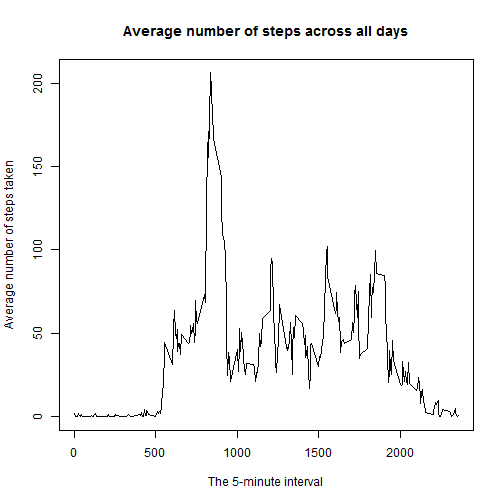

# Reproducible Research: Peer Assessment 1


## Loading and preprocessing the data
## Show any code that is needed to:

### 1. Load the data (i.e. read.csv())

```r
FILE = "activity.csv"
## A. Unzip data activity
if (!file.exists(FILE)) {
    unzip("activity.zip", exdir = ".")
}
data <- read.csv(FILE)
```


### 2. Process/transform the data (if necessary) into a format suitable for your analysis


```r
data$date = as.Date(as.character(data$date), "%Y-%m-%d")
```


## What is mean total number of steps taken per day?
### 1. Make a histogram of the total number of steps taken each day

```r
cleandata <- na.omit(data)
datasum = aggregate(steps ~ date, cleandata, sum)
hist(datasum$steps, main = "Total number of steps taken each day", xlab = "Steps")
```

 


### 2. Calculate and report the mean and median total number of steps taken per day

```r
meanstep = mean(datasum$steps)
medianstep = median(datasum$steps)
```

* The mean total number of steps taken per day: ___1.0766 &times; 10<sup>4</sup>___
* The median total number of steps taken per day: ___10765___

## What is the average daily activity pattern?
### 1. Make a time series plot (i.e. type = "l") of the 5-minute interval (x-axis) and the average number of steps taken, averaged across all days (y-axis)

```r
dataInterval = aggregate(steps ~ interval, cleandata, mean)
plot(dataInterval$interval, dataInterval$steps, type = "l", main = "Average number of steps across all days", 
    xlab = "The 5-minute interval", ylab = "Average number of steps taken")
```

 


### 2. Which 5-minute interval, on average across all the days in the dataset, contains the maximum number of steps?

```r
maxId = which.max(dataInterval$steps)
maxInterval = dataInterval[maxId, "interval"]
maxStep = dataInterval[maxId, "steps"]
```

* The 5-minute interval that contains the maximum number of steps is: 
the ___835___ interval with ___206.1698___ steps.

## Imputing missing values

### 1. Calculate and report the total number of missing values in the dataset (i.e. the total number of rows with NAs)

```r
totalOfNA = sum(is.na(data$steps))
```

* The total number of missing values is: __2304__

### 2. Devise a strategy for filling in all of the missing values in the dataset. The strategy does not need to be sophisticated. For example, you could use the mean/median for that day, or the mean for that 5-minute interval, etc.

* I devise the strategy to fill the missing values with the __mean for that 5-minute interval__.

### 3. Create a new dataset that is equal to the original dataset but with the missing data filled in.

```r
newdataset = data
intervals = unique(data$interval)
for (interval in intervals) {
    meansteps = mean(na.omit(data[data$interval == interval, ]$steps))
    newdataset[data$interval == interval & is.na(data$steps), ]$steps = meansteps
}
```


### 4. Make a histogram of the total number of steps taken each day and Calculate and report the mean and median total number of steps taken per day. Do these values differ from the estimates from the first part of the assignment? What is the impact of imputing missing data on the estimates of the total daily number of steps?

```r
newdatasum = aggregate(steps ~ date, newdataset, sum)
hist(newdatasum$steps, main = "Total number of steps taken each day", xlab = "Steps")
```

 

```r

newmeanstep = mean(newdatasum$steps)
newmedianstep = median(newdatasum$steps)
```

* The mean total number of steps taken per day: ___1.0766 &times; 10<sup>4</sup>___
* The median total number of steps taken per day: ___1.0766 &times; 10<sup>4</sup>___

These values differ from the estimates from the first part of the assignment,
exceptfor the mean number of steps taken per day, it's the same as first part.
It turns out the __media__ and the __median__ are the same.

## Are there differences in activity patterns between weekdays and weekends?
### 1. Create a new factor variable in the dataset with two levels - "weekday" and "weekend" indicating whether a given date is a weekday or weekend day.


```r
newdataset["dateIs"] = factor(sapply(newdataset$date, function(x) {
    if (weekdays(x) == "Sunday" | weekdays(x) == "Saturday") {
        "weekend"
    } else {
        "weekday"
    }
}))
```


### 2. Make a panel plot containing a time series plot (i.e. type = "l") of the 5-minute interval (x-axis) and the average number of steps taken, averaged across all weekday days or weekend days (y-axis). The plot should look something like the following, which was creating using simulated data:

```r
dataStepsDateIs = aggregate(steps ~ interval + dateIs, mean, data = newdataset)
library(lattice)
xyplot(steps ~ interval | dateIs, data = dataStepsDateIs, type = "l", layout = c(1, 
    2), xlab = "Interval", ylab = "Number of steps")
```

 


